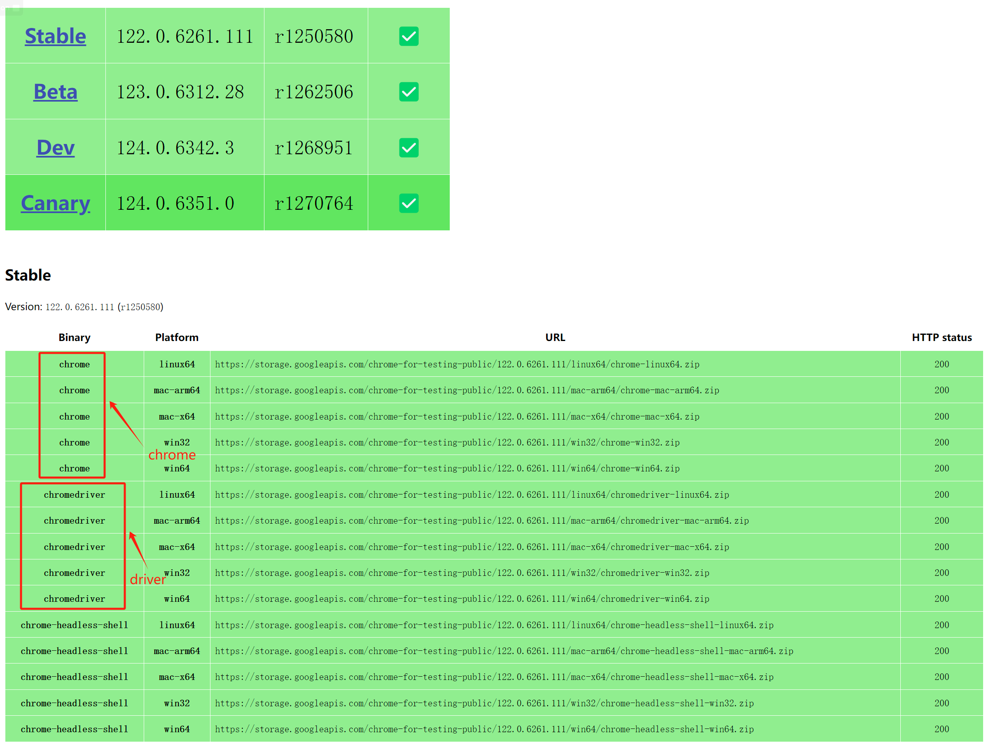
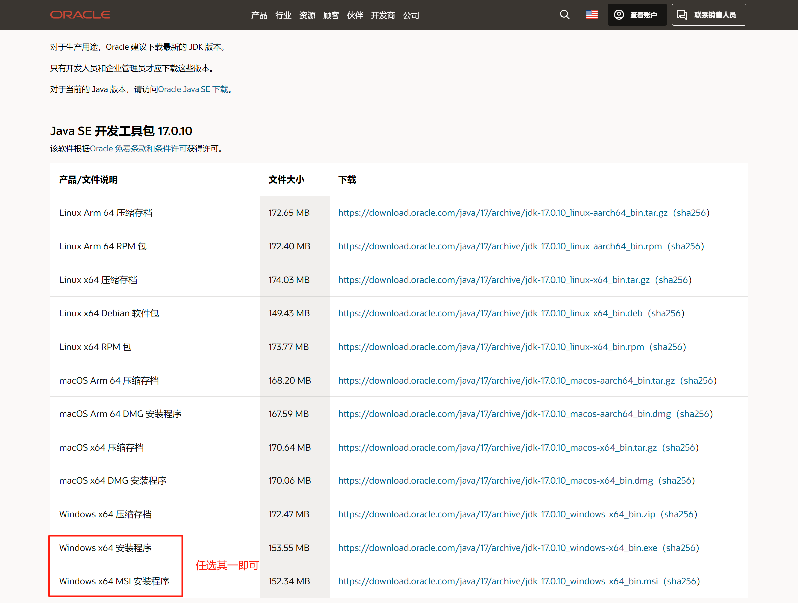
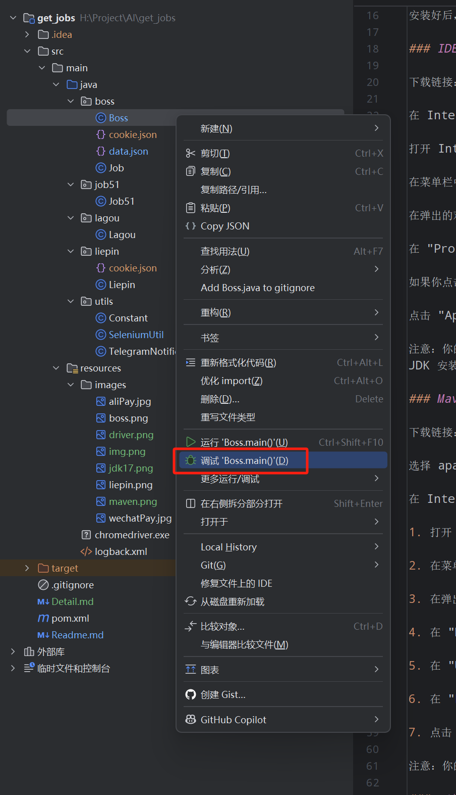

### 驱动配置

driver目前路径：[src/main/resources/chromedriver.exe](src/main/resources/chromedriver.exe)
，Chrome需要更新到最新版本。  
如启动报错，则是因为版本升级导致，需要更新版本  
driver 下载链接：https://googlechromelabs.github.io/chrome-for-testing

### JDK17

下载链接：https://www.oracle.com/java/technologies/javase/jdk17-archive-downloads.html

安装好后，请保存自己的安装路径，可以在IDEA内配置Java，无须配置环境变量

### IDEA

下载链接：https://www.jetbrains.com/idea/download/#section=windows

在 IntelliJ IDEA 中配置 JDK 的步骤如下：

打开 IntelliJ IDEA。

在菜单栏中，选择 "File" -> "Project Structure"。

在弹出的对话框中，选择 "Project" 选项。

在 "Project SDK" 部分，点击新建按钮（如果你还没有配置过 JDK），或者从下拉菜单中选择一个已经配置过的 JDK。

如果你点击了新建按钮，会弹出一个文件选择对话框。在这个对话框中，找到你的 JDK 安装目录，然后点击 "OK"。

点击 "Apply"，然后点击 "OK"，以保存你的更改。

注意：你的 JDK 安装目录应该包含 bin、lib 等子目录，以及 src.zip、LICENSE 等文件。例如，如果你在 Windows 上安装了 JDK，那么你的
JDK 安装目录可能是 C:\Program Files\Java\jdk1.8.0_231（这个路径可能会因为你的 JDK 版本和安装位置不同而不同）。

### Maven

下载链接：https://maven.apache.org/download.cgi  

选择 `apache-maven-3.9.6-bin.zip` 下载即可

在 IntelliJ IDEA 中配置 Maven 的步骤如下：

1. 打开 IntelliJ IDEA。

2. 在菜单栏中，选择 "File" -> "Settings" (Windows/Linux) 或 "IntelliJ IDEA" -> "Preferences" (macOS)。

3. 在弹出的对话框中，从左侧导航栏选择 "Build, Execution, Deployment" -> "Build Tools" -> "Maven"。

4. 在 "Maven home directory" 文本框中，输入你的 Maven 安装目录的路径，或者点击右侧的文件夹图标，从文件选择对话框中选择你的 Maven 安装目录。

5. 在 "User settings file" 文本框中，输入你的 `settings.xml` 文件的路径，或者点击右侧的文件夹图标，从文件选择对话框中选择你的 `settings.xml` 文件。这个文件通常位于你的 Maven 安装目录的 `conf` 子目录下，或者在你的用户目录下的 `.m2` 子目录下。

6. 在 "Local repository" 文本框中，输入你的本地 Maven 仓库的路径，或者点击右侧的文件夹图标，从文件选择对话框中选择你的本地 Maven 仓库。这个仓库通常位于你的用户目录下的 `.m2` 子目录下。

7. 点击 "Apply"，然后点击 "OK"，以保存你的更改。

注意：你的 Maven 安装目录应该包含 `bin`、`boot`、`conf` 等子目录，以及 `LICENSE`、`NOTICE`、`README.txt` 等文件。例如，如果你在 Windows 上安装了 Maven，那么你的 Maven 安装目录可能是 `C:\Program Files\Apache\maven`（这个路径可能会因为你的 Maven 版本和安装位置不同而不同）。

### 下载依赖
配置好maven后，IDEA会开始自动下载依赖，等待下载完成且代码没有报红即可运行代码  
如下图,标记位置为手动刷新：   

### 运行代码
运行代码前，需要修改代码中的配置，如投递页数、投递关键词等，详情请参阅[配置说明](Readme.md)  

