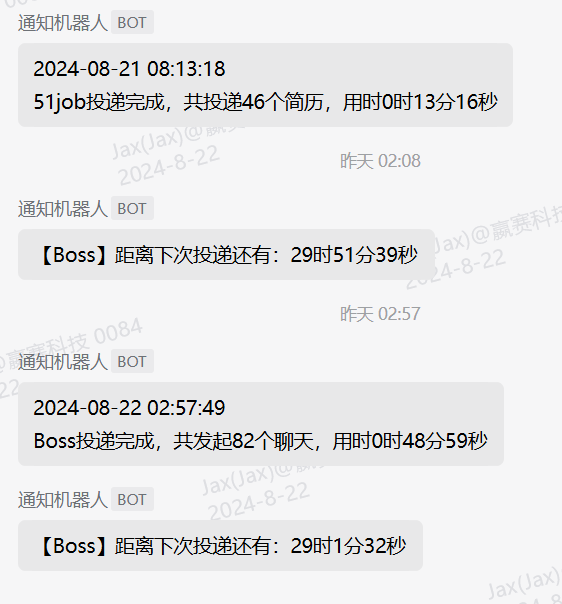
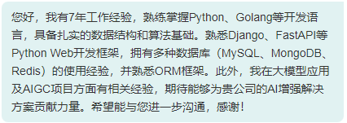
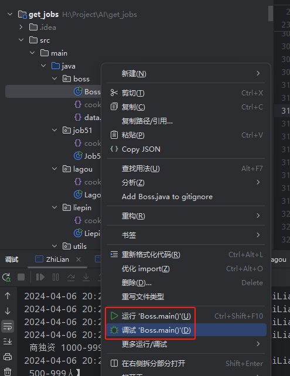
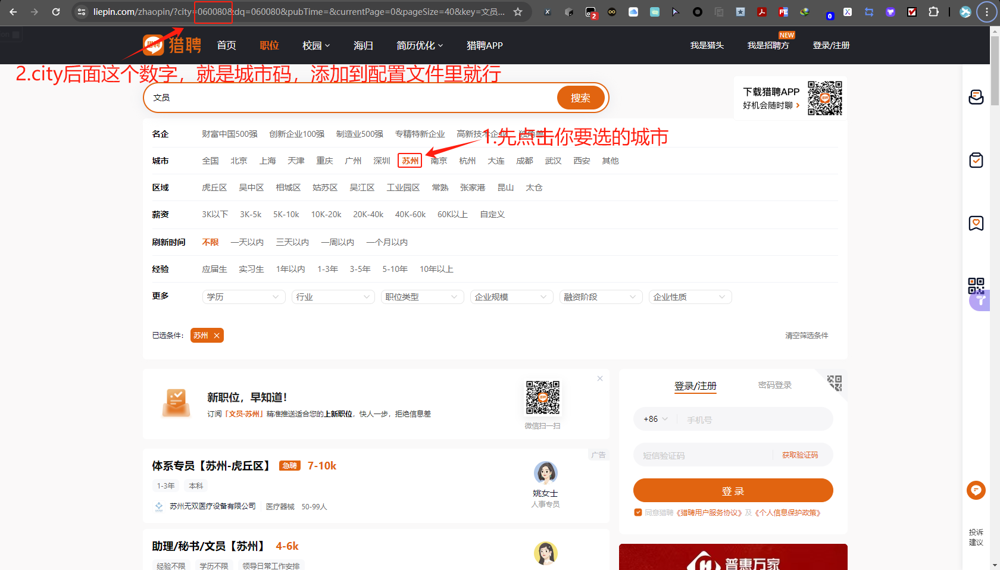

<h1 align="center">🍀Get Jobs【工作无忧】</h1>
<div align="center">

[](https://github.com/loks666/get_jobs)
[][qq-link]
[](https://github.com/loks666/get_jobs/blob/master/LICENSE)
[](https://github.com/loks666/get_jobs/issues?q=is%3Aissue+is%3Aclosed)
[](https://github.com/loks666/get_jobs/forks)
</div>

### 🌴源码地址

- Github(国外访问)：https://github.com/loks666/get_jobs
- Gitee·码云(中国大陆)：https://gitee.com/lok666/get_jobs

### AI代理购买

- 💥https://api.ruyun.fun/ [**支持市面全部大模型！限时折扣1.5比1！1刀也可充，详情请联系站内客服**]

### 🌞 特色功能

- 💥AI检测岗位匹配度，并根据岗位JD自动撰写适合岗位的打招呼语(仅Boss)
- 💥支持国内全部招聘平台(Boss直聘、猎聘、拉勾、51job、智联招聘)
- 💥定时投递，一键投递所有平台，并且再第二天自动定时重新投递
- 💥Boos自动过滤 **不活跃HR**、**猎头岗位**、**目标薪资**，可自行在配置文件修改
- 企业微信消息推送，实时掌控建立投递情况
- Boss自动更新黑名单企业，避免重复投递
- 内置driver驱动(仅win11)，自动判断系统环境适配驱动版本
- 集中化配置，仅需修改配置文件即可完成自定义筛选
- 超长cookie登录，大部分平台每周仅需扫码一次
- 内置xpathHelper插件，方便快速定位元素
- 全局日志记录，投递记录可追踪
- QQ交流群暗號：get_jobs

### 🔞️ 注意事项

- ❌必须要关闭墙外代理，由于主要针对的国内平台，墙外代理会导致页面加载缓慢
- 💪🏻如你有“折腾精神”希望自己配置，QQ群内提供免费答疑，如你不想麻烦，可联系群主付费部署
- 📰由于不同系统的页面不一样，导致可能不兼容，文末会给出文档，尽可能让大家能自定义修改
- 🚩如您不方便访问github，可使用码云镜像(中国大陆)版本：[gitee/getjobs](https://gitee.com/loks666/get_jobs)

> 已经有人在交流群里 **发广告** 等与本项目无关的信息  
> 如果带着不同目的或者没想清楚就进群的  
> 一经发现群主会对您的家人及朋友进行亲切(**没有素质**)的问候  
> 并将您请出群聊，请珍惜交流的机会，谢谢！

## 🚀 如何使用？

### 1️⃣ 使用git拉取代码

```
git clone https://github.com/loks666/get_jobs.git
cd get_jobs
```

### 2️⃣ 环境配置:JDK17+、Maven、Chrome、ChromeDriver

- 目前程序自动判断系统环境，使用对应的chromedriver，并进行浏览器操作
- 但是你的Chrome版本必须是在[Chrome官网](https://googlechromelabs.github.io/chrome-for-testing)下载的，并且为对应版本(
  默认最新)，才可使用
- 非windows的操作系统，请自行下载对应的驱动到src/main/resources路径下解压使用

更多环境配置详情请点击：📚 [环境配置](https://github.com/loks666/get_jobs/wiki/环境配置)

### 3️⃣ 修改配置文件(一般默认即可,需要修改自己的地区和岗位)

- 🔩 通用配置
    - 日志文件在 **target/logs** 目录下，所有日志都会输出在以运行日期结尾的日志文件中
    - **Constant.WAIT_TIME**：超时等待时间，单位秒，用于等待页面加载
    - **cookie登录**: 扫码后会自动保存**cookie.json**文件在代码运行目录下，换号直接删除**cookie.json**即可
    - 每个平台的配置转换码都在平台文件夹下的Enum类里，找到相应的代码添加到类中即可

- 📢 企业微信消息推送设置
    - 把[.env_template](src/main/resources/.env_template)文件重命名为`.env`
    - 在企业微信中创建一个群聊，然后添加机器人，获取到机器人URL，复制到`.env`文件中的`HOOK_URL`即可
    - 保持[config.yaml](src/main/resources/config.yaml)文件中`bot.is_send`为true
    - 企业微信推送示例  
      

  > 完成以上配置，在每个平台投递结束简历后，便会在企业微信的群聊内，推送岗位的投递情况，无须改动其他代码

- 🤖 AI配置
    - `.env`配制如下：
      ```
      HOOK_URL=https://qyapi.weixin.qq.com/cgi-bin/webhook/send?key=your_key_here
      BASE_URL=https://api.openai.com
      API_KEY=sk-xxx
      MODEL=gpt-4o-mini
      ```
    - `HOOK_URL`：企业微信机器人推送的链接
    - `BASE_URL`：直连或中转链接地址，如果是直连需要开梯子
    - `API_KEY`：调用的API KEY
    - `MODEL`：需要使用的模型名称
  > 根据测试，boss直聘在每天所有的岗位投递结束后消耗的额度(gpt-4o-mini)大约在0.06美元(6美分)
  左右，代理除了在本项目中可用，也可使用客户端(https://github.com/knowlimit/ChatGPT-NextWeb)在日常生活中使用，所以不会浪费，充值额度1刀起，随用随充

  > 💥注意！AI代理地址:如云API:https://api.ruyun.fun/
  ，该网站可自主充值需要的金额，无任何捆绑消费，支持市面上全部大模型，限时折扣1.5人民币=1美元，仅限前50名注册用户，注册用户达到50名后，代理价格将全部恢复为2人民币=1美元，过时不候，手快有手慢无，需要的兄弟抓紧了
    - AI生成的打招呼语示例  
      


- ⚙️ **主要的配置文件**（[config.yaml](src/main/resources/config.yaml))

```
# 带[ ]括号的，就是多选，不带的就是单选
boss:
sayHi: "您好,我有7年工作经验,还有AIGC大模型、Java,Python,Golang和运维的相关经验,希望应聘这个岗位,期待可以与您进一步沟通,谢谢！" #必须要关闭boss的自动打招呼
keywords: [ "大模型工程师", "AI工程师", "Java", "Python", "Golang" ] # 需要搜索的职位,会依次投递
industry: [ "不限" ] # 公司行业，只能选三个，相关代码枚举的部分，如果需要其他的需要自己找
cityCode: [ "上海" ] # 只列举了部分,如果没有的需要自己找：目前支持的：全国 北京 上海 广州 深圳 成都
experience: [ "不限" ] # 工作经验："应届毕业生", "1年以下", "1-3年", "3-5年", "5-10年", "10年以上"
jobType: "不限" #求职类型："全职", "兼职"
salary: "不限" # 薪资（单选）："3K以下", "3-5K", "5-10K", "10-20K", "20-50K", "50K以上"
degree: [ "不限" ] # 学历: "初中及以下", "中专/中技", "高中", "大专", "本科", "硕士", "博士"
scale: [ "不限" ] # 公司规模："0-20人", "20-99人", "100-499人", "500-999人", "1000-9999人", "10000人以上"
stage: [ "不限" ] # "未融资", "天使轮", "A轮", "B轮", "C轮", "D轮及以上", "已上市", "不需要融资"
expectedSalary: [ 25,35 ] #期望薪资，单位为K，第一个数字为最低薪资，第二个数字为最高薪资，只填一个数字默认为最低薪水
filterDeadHR: true # 是否过滤不活跃HR,该选项会过滤半年前活跃的HR
enableAI: true #开启AI检测与自动生成打招呼语

job51:
jobArea: [ "上海" ]  #工作地区：目前只有【北京 成都 上海 广州 深圳】
keywords: [ "java", "python", "go", "golang", "大模型", "软件工程师" ] #关键词：依次投递
salary: [ "不限" ] #薪资范围：只能选5个【"2千以下", "2-3千", "3-4.5千", "4.5-6千", "6-8千", "0.8-1万", "1-1.5万", "1.5-2万", "2-3万", "3-4万", "4-5万", "5万以上"】

lagou:
keywords: [ "AI工程师","Java","Golang","Python" ] #搜索关键词
cityCode: "上海" #拉勾城市名没有限制,直接填写即可
salary: "不限" #薪资【"不限","2k以下", "2k-5k", "5k-10k", "10k-15k", "15k-25k", "25k-50k", "50k以上"】
scale: [ "不限" ] #公司规模【"不限","少于15人", "15-50人", "50-150人", "150-500人", "500-2000人", "2000人以上"】
gj: "在校/应届,3年及以下"

liepin:
cityCode: "上海" # 目前支持的：全国 北京 上海 广州 深圳 成都
keywords: [ "Java", "Python", "Golang", "大模型" ]
salary: "不限" # 填 15$30 代表 15k-30k

zhilian:
cityCode: "上海"
salary: "25001,35000" #薪资区间
keywords: [ "AI", "Java", "Python", "Golang" ]

ai:
introduce: "我熟练使用Spring Boot、Spring Cloud、Alibaba Cloud及其生态体系，擅长MySQL、Oracle、PostgreSQL等关系型数据库以及MongoDB、Redis等非关系型数据库。熟悉Docker、Kubernetes等容器化技术，掌握WebSocket、Netty等通信协议，拥有即时通讯系统的开发经验。熟练使用MyBatis-Plus、Spring Data、Django ORM等ORM框架，熟练使用Python、Golang开发，具备机器学习、深度学习及大语言模型的开发与部署经验。此外，我熟悉前端开发，涉及Vue、React、Nginx配置及PHP框架应用" #这是喂给AI的提示词，主要介绍自己的优势
prompt: "我目前在找工作,%s,我期望的的岗位方向是【%s】,目前我需要投递的岗位名称是【%s】,这个岗位的要求是【%s】,如果这个岗位和我的期望与经历基本符合，注意是基本符合，那么请帮我写一个给HR打招呼的文本发给我，如果这个岗位和我的期望经历完全不相干，直接返回false给我，注意只要返回我需要的内容即可，不要有其他的语气助词，重点要突出我和岗位的匹配度以及我的优势，我自己写的招呼语是：【%s】,你可以参照我自己写的根据岗位情况进行适当调整" #这是AI的提示词，可以自行修改

bot:
is_send: true #开启企业微信消息推送
```

- boss直聘([Boss.java](src/main/java/boss/Boss.java))【最推荐！每日仅可发起100次新聊天，活跃度还行，但是每日投递次数太少】

  > 注意：Boss必须要关闭自动打招呼，设置配置文件的sayHi为你的打招呼语，否则会投递失败  
  > 投递结束后会自动更新黑名单企业，发送过不合适等消息的HR的公司会加入黑名单，不会在投递该公司  
  > 现在找工作是很难，但也别做舔狗，打工人不是牛马！
    - 目标薪资设置：expectedSalary: [ 25,35 ]
        - 单位为K，第一个数字为最低薪资，第二个数字为最高薪资，只填一个数字默认为只要求最低薪水，不要求最高薪水

  ```
    data.json //黑名单数据，在投递结束后会查询聊天记录寻找不合适的公司添加进去
        ├── blackCompanies: List.of("复深蓝"); // 公司黑名单，多个用逗号分隔
        ├── blackRecruiters: List.of("猎头"); // 排除招聘人员，比如猎头
        └── blackJobs: List.of("外包", "外派"); // 排除岗位，比如外包，外派
  ```

- 51job([Job.java](src/main/java/job51/Job51.java))【投递有上限，且限制搜索到的岗位数量，没什么活人】

  > 51job现在已经烂掉了，不建议使用  
  > 现在投递一段时间后会出现投递上限  
  > 目前的解决方式是投一页暂停10秒，先这么着吧

- 拉勾([Lagou.java](src/main/java/lagou/Lagou.java))【投递无上限，会限制投递的频率，没什么活人而且投不了几个岗位】

  > 默认使用微信扫码，请绑定微信账号  
  > 拉勾需要指定默认投递简历(在线简历 or 附件简历)，否则会投递失败  
  > 拉勾直接使用的是微信扫码登录，运行后直接扫码即可，开箱通用  
  > 但是拉勾由于反爬机制较为严重，代码中嵌套了大量的sleep，导致效率较慢  
  > 这边建议拉勾的脚本运行一段时间后差不多就行了，配合手动在app或者微信小程序投递简历效果更佳！  
  > 拉勾目前有个玄学bug，投递的时候随机失败，可以解决的大佬请联系我

- 猎聘([Liepin.java](src/main/java/liepin/Liepin.java))【默认打招呼无上限，主动发消息有上限，虽然成功率不高，好在量大，较为推荐】

  > 注意：需要在猎聘App最新版设置打招呼语(默或者自定义皆可)，即可自动发送消息，不会被限制  
  > 只可微信扫码，请绑定微信账号  
  > 需要使用最新版猎聘手机app设置打招呼文本，只要不主动发消息，可以无限制对猎头打招呼，程序默认为该配置。


- 智联招聘([ZhiLian.java](src/main/java/zhilian/ZhiLian.java))【投递上限100左右，岗位质量较差,走投无路可以考虑】

  > 智联招聘需要指定默认投递简历(在线简历 or 附件简历)，否则会投递失败  
  > 只可微信扫码，请绑定微信账号

### 4️⃣ 运行代码

- 🏃🏻‍♂️‍➡️ 直接运行你想要投递平台的下的代码即可  
  

### 5️⃣ 定时投递

- 目前默认Boss会定时投递两次，可以修改相关代码修改时间
- 每个包下的Scheduled文件，即使单独针对平台的定时投递，例：[BossScheduled.java](src/main/java/boss/BossScheduled.java)
  ，就是boss平台每天定时投递
- 定时投递第一次运行时会立即投递一次，到了第二天设定的时间，会再次投递，时间可以自行在代码中修改

****

### ✍🏼 例:Boss投递日志


### ✍🏼 猎聘投递日志


### ✍🏼 寻找城市码



## 📧 联系方式

- V2VDaGF0OkFpckVsaWF1azk1Mjcs6K+35aSH5rOo77ya5pq06aOO6Zuo5bCx6KaB5p2l5LqG

## 👨🏻‍🔧 QQ群

- 扫码添加：QQ加群答案为本项目仓库名【get_jobs】

<div style="display: flex;">
    

</div>

> 点击下面的链接可直接加群，微信群由于没有活跃度，所以停止了

[![][qq-shield-badge]][qq-link]

## 🚩 环境部署问题

> 本项目文档已相对完善，如有运行仍有问题，请添加QQ群联系群主或在群内沟通

- 请注意：
    1. 本项目不支持服务器部署，无须尝试，如招聘网站发现访问者为服务器IP，不会返回任何网站数据。
    2. 在开发与部署过程有任何问题都可在群内沟通，但群内的同学没有义务必须要解决您的问题，请保持礼貌提问的态度。

> 注：本项目为免费开源项目，非Saas类出售商品，不会考虑任何兼容的设备以及他人的需求，如多位同学有相同的需求可以提出issue，具有一定需求性会考虑开发，其他的问题有能力就自己修改，否则请联系群主，非诚勿扰。
--- 

## 📑 更新日志

- 2024-04-15 01:52:18
    1. 新增config.yaml,目前仅需修改配置文件即可，已全平台支持
    2. cookie有效期延长，保持至少一周（拉勾平台除外）【安慰剂】
- 2024-04-28 15:20:06
    1. boos：自动更新黑名单公司
- 2024-06-06 01:49:38
    1. boos：若公司名小于2个字或4个字母则不会添加进黑名单
    2. 添加linux系统支持。
- 2024-06-06 17:41:20
    1. boss支持多城市投递。
- 2024-08-11 18:39:56
    1. 修复智联，猎聘等不能投递的问题。
    2. 添加定时投递功能
- 2024-08-12 22:56:20
    1. 添加企业微信消息推送功能

--- 

## 🤝 参与贡献

我们非常欢迎各种形式的贡献  
如果你对贡献代码感兴趣  
可以查看我们的 [Issues](https://github.com/loks666/get_jobs/issues)
和 [discussions](https://github.com/loks666/get_jobs/discussions)  
期待你的大展身手，向我们展示你的奇思妙想。

- 提交Pr流程：
    1. fork本项目
    2. 从master分支新建分支
    3. 开发完成后提交pull request到lok666/get_jobs的【dev】分支，注意是dev！！！
    4. 等待管理员审核验证提交代码无误后，合并到main分支

[![][pr-welcome-shield]][pr-welcome-link]

--- 

### 📰 开源协议

<details><summary><h4>📝 License</h4></summary>

[](https://app.fossa.com/projects/git%2Bgithub.com%2Floks666%2Fget_jobs/refs/branch/master/f1c1fbec331aec96694d8ab331fc720bb2aa84b4)
</details>

--- 

- 授人以渔: [自定义修改你的代码](https://github.com/loks666/get_jobs/wiki/授人以渔‐自定义修改你的代码)
- 本项目受此启发:https://github.com/BeammNotFound/get-jobs-51job , 感谢大佬，让我们将爱传递下去~
- 本项目创建于: 2024年3月7日 21:34:58

---

### ☕️ Github Star历史

[](https://starchart.cc/loks666/get_jobs)


<!-- LINK GROUP -->

<!-- [![][fossa-license-shield]][fossa-license-link] -->

[qq-link]: https://qm.qq.com/q/qJwmIrqPU

[qq-shield-badge]: https://img.shields.io/badge/QQ交流群-get_jobs-0FB5EB?labelColor=235389&logo=tencent-qq&logoColor=white&style=flat

[pr-welcome-link]: https://github.com/loks666/get_jobs/pulls

[pr-welcome-shield]: https://img.shields.io/badge/🤯_pr_welcome-%E2%86%92-ffcb47?labelColor=black&style=for-the-badge

[fossa-license-shield]: https://app.fossa.com/api/projects/git/Bgithub.com/Floks666/Fget_jobs.svg?type=shield

[fossa-license-link]: https://app.fossa.com/projects/git/Bgithub.com/Floks666/Fget_jobs?ref=badge_shield