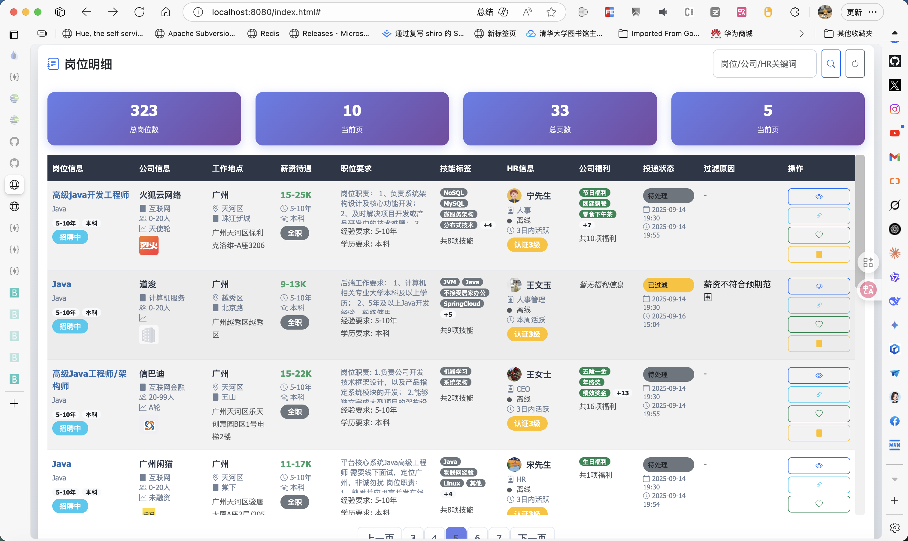

## 运行界面



## 运行准备
### jdk21

### 补全`application-gpt.yml`配置
api-key: ${OPENAI_API_KEY} -> api-key: ${OPENAI_API_KEY:xxx}
不用AI功能默认值随便填一个xxx，否则填自己申请的key
```yaml
spring:
  ai:
    openai:
      api-key: ${OPENAI_API_KEY:xxx}
```

## 运行
`getjobs.GetJobsApplication` 直接运行main函数

```java
public static void main(String[] args) {
        SpringApplication.run(GetJobsApplication.class, args);
    }
```
### 访问
浏览器访问 http://localhost:8080