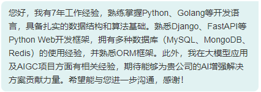
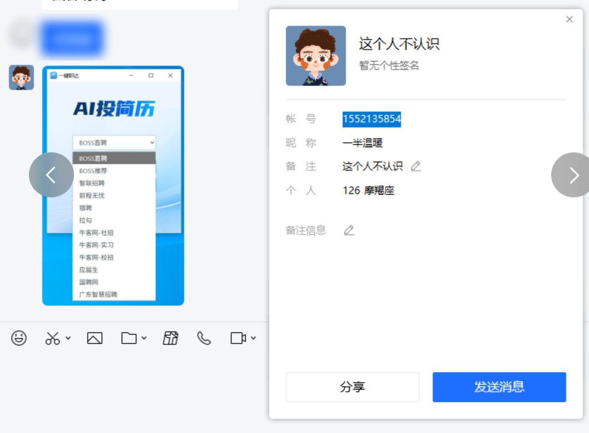

<h1 align="center">🍀 Get Jobs【工作无忧】</h1>
<div align="center">

[](https://github.com/loks666/get_jobs)
[][qq-link]
[](https://github.com/loks666/get_jobs/blob/master/LICENSE)

[](https://github.com/loks666/get_jobs/forks)

</div>
<div align="center">
<h2 align="center">黑暗无论多么长，光明迟早总是会来的</h2>
<p><strong>我知道你心中有煎熬，有焦虑，像一柄长剑悬在头顶，随时可能落下。</strong><br>
<strong>黎明破晓之时，苦难都将化作勋章</strong></p>
<strong>🪅GUI版本盛大登场</strong>

<p align="center">
  <a href="https://trendshift.io/repositories/9608">
    
  </a>
</p>
</div>

- 📌 **目前该项目存在的问题**
    - 【紧急】目前Boss新增了检测机制，导致网页被回退，目前解决的问题是首页已完成正常访问，但在投递过程中会不断的刷新，如哪位有解决的办法，请务必分享，感激不尽，讨论链接：https://github.com/loks666/get_jobs/discussions/250（已解决）
    - Boss 的 AI 消息发送功能目前仍存在 Bug，AI 消息可能无法正常发送，相关问题还在处理中。
    - 当前智联招聘平台有问题，其他平台可正常使用，如有兄台解决了智联招聘投递问题沟通后可提交pr。
    - 本项目已改为禁止商业化的开源协议,请勿将此项目进行商业化
    - [【重要】跳转到文末更新日志](#-更新日志)
    - 老版本在本项目的genesis分支上，目前可能暂停更新，如有修复老版本问题的可联系后提交pr
    - 前端项目的编译版本会发布在release页面，如不想启动前端，可将dist文件夹放到resources文件夹下直接启动后端使用

### 🌴源码地址

- Github(国外访问)：https://github.com/loks666/get_jobs
- Gitee·码云(中国大陆)：https://gitee.com/lok666/get_jobs

### AI代理暂时已停用，在联系解决中，未解决前请勿使用

- https://api.ruyun.fun/ [**支持市面全部大模型！折扣比例2比1！1刀也可充，详情请联系站内客服**]

## 🌟 特色功能

- **🖥️ 图形化界面**：直观的网页管理界面，方便配置与运行，降低上手成本。
- **💥 AI 智能匹配**：AI检测岗位匹配度，并根据JD自动撰写个性化的打招呼语（仅限 Boss 直聘）。
- **📷️ 图片简历**：Boos直聘可在发送打招呼语后自动发送图片简历，无须等待HR索要简历，有效提高回复率。
- **🔎 智能过滤**：自动过滤 **不活跃 HR**、**猎头岗位**、**目标薪资**，让你的简历投递更精准。
- **📢 实时通知**：通过企业微信消息推送，实时掌握简历投递情况，不错过任何机会。
- **🚫 黑名单功能**：自动更新黑名单企业，避免重复投递不合适的公司，提高投递效率。
- **🛠️ 易于配置**：集中化配置，只需修改配置文件即可自定义筛选条件，轻松上手。
- **🔄 持久登录**：支持超长 Cookie 登录，大部分平台每周仅需扫码一次，减少重复操作。

### 🔞️ 注意事项

- ❌必须要关闭墙外代理，由于主要针对的国内平台，墙外代理会导致页面加载缓慢
- 💪🏻如你有“折腾精神”希望自己配置，QQ群内提供免费答疑，如你不想麻烦，可进入群聊查看群公告
- 📰由于不同系统的页面不一样，导致可能不兼容，文末会给出文档，尽可能让大家能自定义修改
- 🚩如您不方便访问github，可使用码云镜像(中国大陆)版本：[gitee/getjobs](https://gitee.com/loks666/get_jobs)

> 已经有人在交流群里 **发广告** 等与本项目无关的信息
> 如果带着不同目的或者没想清楚就进群的
> 一经发现群主会对您的家人及朋友进行亲切(**没有素质**)的问候
> 并将您请出群聊，请珍惜交流的机会，谢谢！

## 🚀 如何使用？

### 1️⃣ 使用git拉取代码

```
git clone https://github.com/loks666/get_jobs.git
cd get_jobs
```

### 2️⃣ 环境配置:Gradle、JDK21

- 目前程序自动判断系统环境，自动下载对应的chromedriver，并进行浏览器操作，需解决网络问题。

更多环境配置详情请点击：📚 [环境配置](https://github.com/loks666/get_jobs/wiki/环境配置)

### 3️⃣ 网页端修改配置，并保存(一般默认即可,需要修改自己的地区和岗位)

- 🤖 AI配置

    - `.env`配制如下：
      ```
      HOOK_URL=https://qyapi.weixin.qq.com/cgi-bin/webhook/send?key=your_key_here
      BASE_URL=https://api.openai.com
      API_KEY=sk-xxx
      MODEL=gpt-5-nano
      ```
    - `HOOK_URL`：企业微信机器人推送的链接
    - `BASE_URL`：直连或中转链接地址
    - `API_KEY`：调用的API KEY
    - `MODEL`：需要使用的模型名称

  > 根据测试，boss直聘在每天所有的岗位投递结束后消耗的额度(gpt-5-nano)大约在0.06美元(6美分)  
  > 左右，代理除了在本项目中可用，也可使用客户端(https://github.com/knowlimit/ChatGPT-NextWeb)进行使用  
  > 在日常生活中使用，所以不会浪费，充值额度1刀起，随用随充  
  > 💥注意！AI代理地址:如云API:https://api.ruyun.fun/
  ，该网站可自主充值需要的金额，无任何捆绑消费，支持市面上全部大模型，2人民币=1美元，base_url默认使用"https://api.ruyun.fun/"
  即可

    - AI生成的打招呼语示例  
      

- boss直聘([Boss.java](src/main/java/boss/Boss.java))【喜大普奔，目前Boss打招呼上限已修改为每日150次】

  **Boss 登录配置:**

  Boss 直聘需要使用登录后的凭证才能正常运行：

  1. 在浏览器中登录 Boss 直聘。

  

  2. 使用 EditThisCookie 或其他 Cookie 导出插件，获取登录后的 Cookie/Token。

  

  3. 将 Cookie/Token 填入项目的 Boss 配置中，再启动程序。

  

  请勿提交、分享或上传包含登录凭证的配置文件；凭证失效后需要重新获取。

  > 注意：设置配置文件的sayHi为你的打招呼语，否则会投递失败
  > 投递结束后会自动更新黑名单企业，发送过不合适等消息的HR的公司会加入黑名单，不会在投递该公司
  > 现在找工作是很难，但也别做舔狗，打工人不是牛马！

- 发送图片简历

  > 在resources文件夹下，将自己的pdf简历转换为resume.jpg，同时配置项sendImgResume为ture，即可自动发送图片简历
  > pdf转图片需要wps会员，如果找不到相关工具，可联系群主帮忙转换，5r/次

- 猎聘([Liepin.java](src/main/java/liepin/Liepin.java))【默认打招呼无上限，主动发消息有上限，成功率不高，好在量大，较为推荐】

  > 注意：需要在猎聘App最新版设置打招呼语(默或者自定义皆可)，即可自动发送消息，不会被限制
  > 只可微信扫码，请绑定微信账号
  > 需要使用最新版猎聘手机app设置打招呼文本，只要不主动发消息，可以无限制对猎头打招呼，程序默认为该配置。

- 51job([Job.java](src/main/java/job51/Job51.java))【投递有上限，且限制搜索到的岗位数量，没什么活人】

  > 51job现在已经烂掉了，不建议使用
  > 现在投递一段时间后会出现投递上限
  > 目前的解决方式是投一页暂停10秒，先这么着吧

- 智联招聘([ZhiLian.java](src/main/java/zhilian/ZhiLian.java))【投递上限100左右，烂掉了，不要用】

  > 智联招聘需要指定默认投递简历(在线简历 or 附件简历)，否则会投递失败
  > 只可微信扫码，请绑定微信账号

### 4️⃣ 运行代码

- 🏃🏻‍♂️‍➡️ 运行启动类即可[GetJobsApplication.java](src/main/java/com/getjobs/GetJobsApplication.java)

---

### 运行截图


---

## 📧 联系方式

- V2VDaGF0OkFpckVsaWF1azk1Mjcs6K+35aSH5rOo77ya5pq06aOO6Zuo5bCx6KaB5p2l5LqG

## 👨🏻‍🔧 QQ群

- 点击下方卡片添加即可：QQ加群答案为本项目仓库名【get_jobs】  
  [][qq-link]

> 点击下面的链接可直接加群，微信群由于没有活跃度，所以停止了

## 🚩 环境部署问题

> 本项目文档已相对完善，如有运行仍有问题，请添加QQ群联系群主或在群内沟通

- 请注意：
    1. 本项目不支持服务器部署，无须尝试，如招聘网站发现访问者为服务器IP，不会返回任何网站数据。
    2. 在开发与部署过程有任何问题都可在群内沟通，但群内的同学没有义务必须要解决您的问题，请保持礼貌提问的态度。

> 注：本项目为免费开源项目，非Saas类出售商品，不会考虑任何兼容的设备以及他人的需求，如多位同学有相同的需求可以提出issue，具有一定需求性会考虑开发，其他的问题有能力就自己修改，否则请联系群主，非诚勿扰。

---

## 📑 更新日志

[更新日志.md](doc/%E6%9B%B4%E6%96%B0%E6%97%A5%E5%BF%97.md)

## 🤝 参与贡献

- 本项目禁止一切未经沟通的pr，会直接拒掉，如有贡献需求，请在issue和discussions中查看自己可以开发的功能和内容，群里与我沟通

---

## 🚀 PR 提交流程（非常重要！）

1. Fork 本项目
2. 从 `main` 分支新建你的个人开发分支
3. 开发完成后，提交 Pull Request 到 **loks666/get_jobs 的 `dev` 分支**  
   （❗ **注意：不是 main，是 dev！**）
4. 提交 Commit 时，请在信息前加上一个符合提交内容的 **Emoji 表情
   **（[emoji网站](https://www.emojiall.com/zh-hans/all-emojis)）自由发挥！
5. 等待管理员审核，验证无误后，代码将合并到 `main` 分支

---

# ✨ 相信自己！

> **"每一个伟大，都有一个平凡的开始"**


---

### 📰 开源协议

[LICENSE](LICENSE)

## Boss 登录配置与已知问题

Boss 直聘需要使用登录后的凭证才能正常运行：

1. 在浏览器中登录 Boss 直聘。


1. 使用 EditThisCookie 或其他 Cookie 导出插件，获取登录后的 Cookie/Token。


1. 将 Cookie/Token 填入项目的 Boss 配置中，再启动程序。


请勿提交、分享或上传包含登录凭证的配置文件；凭证失效后需要重新获取。

> 已知问题：Boss 的 AI 消息发送功能目前仍存在 Bug，AI 消息可能无法正常发送，相关问题还在处理中。

- 市面上充斥着很多使用本项目招摇撞骗的项目，请擦亮眼睛，谨防上当受骗。
- 目前已收到多人举报，会有别有用心的人，潜伏在群里，通过搜索群内用户的QQ号添加好友，通过后就推广自己的收费项目，已有多人受骗，比如像下面这个项目，如你发现，请积极联系我，并问候下他的亲朋好友，谢谢
- 另外注明，这个所谓一键直达的项目，由于自己推广不力，不断的在本项目群里骚扰用户，想碰瓷本项目，不胜其烦，几乎和狗皮膏药一样，如你碰到了，请帮我淬两口，并吐一口痰，感谢你好心人。
- 

---

### ☕️ Github Star历史

[](https://starchart.cc/loks666/get_jobs)

<!-- LINK GROUP -->

<!-- [![][fossa-license-shield]][fossa-license-link] -->

[qq-link]: https://qm.qq.com/q/qJwmIrqPU

[qq-shield-badge]: https://img.shields.io/badge/QQ交流群-get_jobs-0FB5EB?labelColor=235389&logo=tencent-qq&logoColor=white&style=flat

[pr-welcome-link]: https://github.com/loks666/get_jobs/pulls

[pr-welcome-shield]: https://img.shields.io/badge/🤯_pr_welcome-%E2%86%92-ffcb47?labelColor=black&style=for-the-badge

[fossa-license-shield]: https://app.fossa.com/api/projects/git/Bgithub.com/Floks666/Fget_jobs.svg?type=shield

[fossa-license-link]: https://app.fossa.com/projects/git/Bgithub.com/Floks666/Fget_jobs?ref=badge_shield
