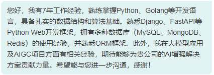
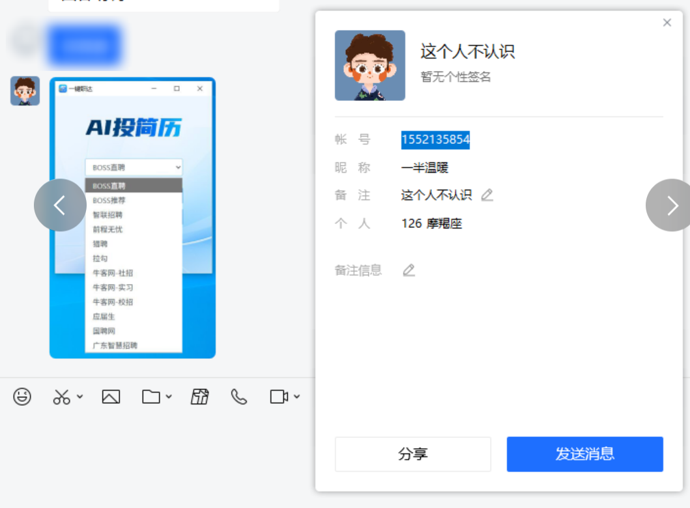

<h1 align="center">🍀 Get Jobs【工作无忧】</h1>
<div align="center">

[](https://github.com/loks666/get_jobs)
[][qq-link]
[](https://github.com/loks666/get_jobs/blob/main/LICENSE)

[](https://github.com/loks666/get_jobs/forks)
[](https://github.com/loks666/get_jobs/releases)
[](https://github.com/loks666/get_jobs/commits/main)

[](https://adoptium.net/temurin/releases/?version=21)
[](https://spring.io/projects/spring-boot)
[](https://gradle.org/)
[](https://github.com/Kaliiiiiiiiii-Vinyzu/patchright)
[](https://www.sqlite.org/)
[](https://nextjs.org/)
[](https://react.dev/)

</div>
<div align="center">
<h2 align="center">黑暗无论多么长，光明迟早总是会来的</h2>
<p><strong>我知道你心中有煎熬，有焦虑，像一柄长剑悬在头顶，随时可能落下。</strong><br>
<strong>黎明破晓之时，苦难都将化作勋章</strong></p>
<strong>🪅GUI盛大登场</strong>

<p align="center">
  <a href="https://trendshift.io/repositories/9608">
    
  </a>
</p>

</div>

- 🔔 *重要更新*  
    - boss已可投递使用，其他平台暂未测试，仍然建议手动在boss端投递，使用本项目在PC兜底使用。
    - 本项目采用 PolyForm Noncommercial 1.0.0 协议，允许免费的非商业使用，禁止任何形式的商业使用；商业授权请联系作者
    - [【重要】跳转到文末更新日志](#-更新日志)
    - 前端项目的编译版本会发布在release页面，如不想启动前端，可将dist文件夹放到resources文件夹下直接启动后端使用

### 🌴源码地址

- Github(国外访问)：https://github.com/loks666/get_jobs
- Gitee·码云(中国大陆)：https://gitee.com/lok666/get_jobs

### 📢 广告位招租

- 本项目月均访问量可观，Star 8.4k+，QQ 交流群活跃，欢迎与求职、AI、开发工具相关的产品洽谈合作
- 合作邮箱：`super_xiang@126.com`，或通过 QQ 群联系

## 🌟 特色功能

- **🖥️ 图形化界面**：直观的网页管理界面，方便配置与运行，降低上手成本。
- **💥 AI 智能匹配**：AI检测岗位匹配度，并根据JD自动撰写个性化的打招呼语（仅限 Boss 直聘）。
- **📷️ 图片简历**：Boos直聘可在发送打招呼语后自动发送图片简历，无须等待HR索要简历，有效提高回复率。
- **🔎 智能过滤**：自动过滤 **不活跃 HR**、**猎头岗位**、**目标薪资**，让你的简历投递更精准。
- **📢 实时通知**：通过企业微信消息推送，实时掌握简历投递情况，不错过任何机会。
- **🚫 黑名单功能**：自动更新黑名单企业，避免重复投递不合适的公司，提高投递效率。
- **🛠️ 易于配置**：集中化配置，只需修改配置文件即可自定义筛选条件，轻松上手。
- **🔄 持久登录**：支持超长 Cookie 登录，大部分平台每周仅需扫码一次，减少重复操作。

### 🔞️ 注意事项

- ❌必须要关闭墙外代理，由于主要针对的国内平台，墙外代理会导致页面加载缓慢
- 💪🏻如你有“折腾精神”希望自己配置，QQ群内提供免费答疑，如你不想麻烦，可进入群聊查看群公告
- 📰由于不同系统的页面不一样，导致可能不兼容，文末会给出文档，尽可能让大家能自定义修改
- 🚩如您不方便访问github，可使用码云镜像(中国大陆)版本：[gitee/getjobs](https://gitee.com/lok666/get_jobs)

> 已经有人在交流群里 **发广告** 等与本项目无关的信息
> 如果带着不同目的或者没想清楚就进群的
> 一经发现群主会对您的家人及朋友进行亲切(**没有素质**)的问候
> 并将您请出群聊，请珍惜交流的机会，谢谢！

## 🚀 如何使用？

### 1️⃣ 使用git拉取代码

```
git clone https://github.com/loks666/get_jobs.git
cd get_jobs
```

### 2️⃣ 环境配置:Gradle、JDK21

- 目前程序自动判断系统环境，自动下载对应的chromedriver，并进行浏览器操作，需解决网络问题。

更多环境配置详情请点击：📚 [环境配置](https://github.com/loks666/get_jobs/wiki/环境配置)

### 3️⃣ 下载数据库文件（新用户必做）

本项目不会自动建表，**没有数据库文件无法启动**。为避免把开发者本机的配置和登录态一起发布，仓库中不包含数据库文件，请从 release 页面下载空数据库：

1. 到 [最新 release](https://github.com/loks666/get_jobs/releases/latest) 下载 `getjobs.db.template`
2. **把它重命名为 `getjobs.db`**
3. 放到项目根目录的 `db/` 文件夹下，最终路径为 `db/getjobs.db`

这个空库已经带好了 16 张表的结构和各平台下拉框的字典数据（城市、行业、经验、学历等共 673 条），配置、Cookie、投递记录都是空的，由你自己在网页端填写。

> ⚠️ 老用户升级时不要覆盖自己已有的 `db/getjobs.db`，否则配置和登录态会全部丢失。

### 4️⃣ 网页端修改配置，并保存(一般默认即可,需要修改自己的地区和岗位)

- 🤖 AI配置

    - `.env`配制如下：
      ```
      HOOK_URL=https://qyapi.weixin.qq.com/cgi-bin/webhook/send?key=your_key_here
      BASE_URL=https://api.openai.com
      API_KEY=sk-xxx
      MODEL=gpt-5-nano
      ```
    - `HOOK_URL`：企业微信机器人推送的链接
    - `BASE_URL`：直连或中转链接地址
    - `API_KEY`：调用的API KEY
    - `MODEL`：需要使用的模型名称

  > 根据测试，boss直聘在每天所有的岗位投递结束后消耗的额度(gpt-5-nano)大约在0.06美元(6美分)左右，日常使用成本很低  
  > 💥`BASE_URL` 填任意兼容 OpenAI 接口格式的地址即可（官方接口或你自己的中转服务都可以），本项目不绑定、不推荐任何第三方代理商

    - AI生成的打招呼语示例  
      

- boss直聘([Boss.java](src/main/java/boss/Boss.java))【喜大普奔，目前Boss打招呼上限已修改为每日150次】

  > 注意：设置配置文件的sayHi为你的打招呼语，否则会投递失败
  > 投递结束后会自动更新黑名单企业，发送过不合适等消息的HR的公司会加入黑名单，不会在投递该公司
  > 现在找工作是很难，但也别做舔狗，打工人不是牛马！

- 发送图片简历

  > 在resources文件夹下，将自己的pdf简历转换为resume.jpg，同时配置项sendImgResume为ture，即可自动发送图片简历
  > pdf转图片需要wps会员，如果找不到相关工具，可联系群主帮忙转换，5r/次

- 猎聘([Liepin.java](src/main/java/liepin/Liepin.java))【默认打招呼无上限，主动发消息有上限，成功率不高，好在量大，较为推荐】

  > 注意：需要在猎聘App最新版设置打招呼语(默或者自定义皆可)，即可自动发送消息，不会被限制
  > 只可微信扫码，请绑定微信账号
  > 需要使用最新版猎聘手机app设置打招呼文本，只要不主动发消息，可以无限制对猎头打招呼，程序默认为该配置。

- 51job([Job.java](src/main/java/job51/Job51.java))【投递有上限，且限制搜索到的岗位数量，没什么活人】

  > 51job现在已经烂掉了，不建议使用
  > 现在投递一段时间后会出现投递上限
  > 目前的解决方式是投一页暂停10秒，先这么着吧

- 智联招聘([ZhiLian.java](src/main/java/zhilian/ZhiLian.java))【投递上限100左右，烂掉了，不要用】

  > 智联招聘需要指定默认投递简历(在线简历 or 附件简历)，否则会投递失败
  > 只可微信扫码，请绑定微信账号

### 5️⃣ 运行代码

- 🏃🏻‍♂️‍➡️ 运行启动类即可[GetJobsApplication.java](src/main/java/com/getjobs/GetJobsApplication.java)

---

### 运行截图


---

## 👨🏻‍🔧 QQ群
[][qq-link]  
[][qq-link-2]


## ☕ 赞赏支持

<div align="center">
<table>
<tr>
<td align="center"><br/>支付宝</td>
<td align="center"><br/>微信支付</td>
</tr>
</table>
</div>

> 本项目免费开源，我从未想到过有人会打赏，直到我某天真的收到了来自某人的赞赏支持，深受触动，所以重新开启了打赏码，不论打赏与否，本项目都将感谢您对本项目的支持与使用！

## 🚩 环境部署问题

> 本项目文档已相对完善，如有运行仍有问题，请添加QQ群联系群主或在群内沟通

- 请注意：
    1. 本项目不支持服务器部署，无须尝试，如招聘网站发现访问者为服务器IP，不会返回任何网站数据。
    2. 在开发与部署过程有任何问题都可在群内沟通，但群内的同学没有义务必须要解决您的问题，请保持礼貌提问的态度。

> 注：本项目为免费开源项目，非Saas类出售商品，不会考虑任何兼容的设备以及他人的需求，如多位同学有相同的需求可以提出issue，具有一定需求性会考虑开发，其他的问题有能力就自己修改，否则请联系群主，非诚勿扰。

---

## 📑 更新日志

[更新日志.md](doc/%E6%9B%B4%E6%96%B0%E6%97%A5%E5%BF%97.md)

## 🤝 参与贡献

- 本项目禁止一切未经沟通的pr，会直接拒掉，如有贡献需求，请在issue和discussions中查看自己可以开发的功能和内容，群里与我沟通

> 感谢每一位为本项目提交过代码的朋友 🙏

<a href="https://github.com/loks666/get_jobs/graphs/contributors">
  
</a>

---

## 🚀 PR 提交流程（非常重要！）

1. Fork 本项目
2. 从 `main` 分支新建你的个人开发分支
3. 开发完成后，提交 Pull Request 到 **loks666/get_jobs 的 `dev` 分支**  
   （❗ **注意：不是 main，是 dev！**）
4. 提交 Commit 时，第一行必须符合格式：`<emoji> <小写英文>.`，即以一个 **Emoji 表情**
   开头（[emoji网站](https://www.emojiall.com/zh-hans/all-emojis)），空格后接**全小写英文**，并以 **`.`** 结尾。
   例如：`🐛 fix cookie table creation on startup.`
   - PR 标题也需符合同样格式（合并时会作为提交信息）。
   - CI 会自动检查，不符合会无法合并。
   - 本地可运行 `sh .githooks/setup.sh` 启用提交前检查和提交模板。
5. 等待管理员审核，验证无误后，代码将合并到 `main` 分支

> 📑 本项目已启用[贡献者许可协议（CLA）](CLA.md)，提交 PR 时需在模板中勾选同意。
> 你的版权仍归你自己，CLA 只是让维护者能在保持项目非商业免费开放的同时对外授予商业许可。

---

# ✨ 相信自己！

> **"每一个伟大，都有一个平凡的开始"**


---

### 📰 开源协议

[LICENSE](LICENSE)

---

### 🙅🏻‍♂️ 谨防受骗

- 市面上充斥着很多使用本项目招摇撞骗的项目，请擦亮眼睛，谨防上当受骗。
- 目前已收到多人举报，会有别有用心的人，潜伏在群里，通过搜索群内用户的QQ号添加好友，通过后就推广自己的收费项目，已有多人受骗，比如像下面这个项目，如你发现，请积极联系我，并问候下他的亲朋好友，谢谢
- 另外注明，这个所谓一键直达的项目，由于自己推广不力，不断的在本项目群里骚扰用户，想碰瓷本项目，不胜其烦，几乎和狗皮膏药一样，如你碰到了，请帮我淬两口，并吐一口痰，感谢你好心人。
- 

---

### ☕️ Github Star历史

<a href="https://star-history.com/#loks666/get_jobs&Date">
  <picture>
    <source media="(prefers-color-scheme: dark)" srcset="https://api.star-history.com/svg?repos=loks666/get_jobs&type=Date&theme=dark" />
    <source media="(prefers-color-scheme: light)" srcset="https://api.star-history.com/svg?repos=loks666/get_jobs&type=Date" />
    
  </picture>
</a>

<!-- LINK GROUP -->

<!-- [![][fossa-license-shield]][fossa-license-link] -->

[qq-link]: https://qm.qq.com/q/qJwmIrqPU

[qq-link-2]: https://qun.qq.com/universal-share/share?ac=1&authKey=qo6bGkogtLrVusb7GI%2Bv08KaTWEofET0bo%2Bdk5hqEk1JEY0II3Lu%2FGXPCoROWZUe&busi_data=eyJncm91cENvZGUiOiI1Nzg3ODU1MDUiLCJ0b2tlbiI6IjRXQklndWdFRkloTlpRUE82UXpUREVSa0FDN3Y2UDI1UE42VHBiV3NmYjNLYkdGczRMKzdId0NHeGdQVXMrRjEiLCJ1aW4iOiIyODQxOTAwNTYifQ%3D%3D&data=DR0uxpwdTVM1YFw3evPIbj_L-79Bp1AU91gfeieGqh8D4uEXGuxAl-lmZ2SEW6UNUuKNBtKzGflIYe6vPa9SqA&svctype=4&tempid=h5_group_info

[qq-shield-badge]: https://img.shields.io/badge/QQ交流群-get_jobs-0FB5EB?labelColor=235389&logo=tencent-qq&logoColor=white&style=flat

[pr-welcome-link]: https://github.com/loks666/get_jobs/pulls

[pr-welcome-shield]: https://img.shields.io/badge/🤯_pr_welcome-%E2%86%92-ffcb47?labelColor=black&style=for-the-badge

[fossa-license-shield]: https://app.fossa.com/api/projects/git/Bgithub.com/Floks666/Fget_jobs.svg?type=shield

[fossa-license-link]: https://app.fossa.com/projects/git/Bgithub.com/Floks666/Fget_jobs?ref=badge_shield
