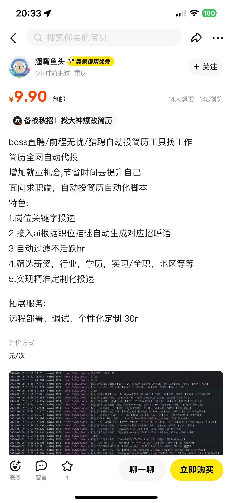

<h1 align="center">🍀 Get Jobs【工作无忧】</h1>
<p align="center">
  <a href="https://github.com/loks666/get_jobs">
    
  </a>
  <a href="[qq-link]">
    
  </a>
  <a href="https://github.com/loks666/get_jobs/blob/master/LICENSE">
    
  </a>
  
  <a href="https://github.com/loks666/get_jobs/forks">
    
  </a>
</p>
<h2 align="center">黑暗无论多么长，光明迟早总是会来的</h2>
<p align="center">
  <a href="https://trendshift.io/repositories/9608">
    
  </a>
</p>


### 写在前面

**我知道你心中有煎熬，有焦虑，像一柄长剑悬在头顶，随时可能落下。  
若黑夜终将黑暗，那你即是黎明。  
黎明前的黑暗，最冷、最险、最难熬。  
但断剑重铸之日，便是英雄归来之时。  
挺过这一刻，纵使刀山火海，又有何惧？**

- [如何使用本程序寻找程序兼职岗位?](doc/part_job.md)
- [你找不到工作，是因为大环境不好吗？【很重要】](doc/doc.md)
- [少侠，请立即开始，你精彩的人生吧！【源自L站】](doc/just_do_it.md)
- [许愿墙](https://fcv1y6gslc.feishu.cn/sheets/JS45sElqAhKhawtTzsYcftymnFe)

    - 如果你有你心仪的工作，请在我这里许下愿望，如果实现了，请记得回来更新状态
    - 许愿墙为飞书文档，你可以编辑好以后，导出为xlsx文档，然后覆盖本项目中resources文件夹中的"**许愿墙.xlsx**"文档
    - 接下来，你就可以把xlsx文档，提交到main分支，然后……你就是本项目的开发者之一了。
    - 你可以在你的简历中加上一条，Github，热门开源项目开发者之一。
    - 但是你需要尽可能的，熟悉本项目的逻辑，去想象某一块功能就是你做的，这样可以更从容，更优雅的"吹牛逼”。
    - 只要你相信你自己，本项目就会帮你，你要记住，是你自己拯救的你自己。

> 需要注意的是，提交pr的commit:请固定使用"✨I can do it！“，然后提交pr即可，剩下的，我全都搞定啦！

- 📌 **目前该项目存在的问题**
    - 当前招聘市场，有效的软件仅有 Boss 和 猎聘(有少部分岗位)。
    - 如果 Boss 出现掉线等问题，请注意两点：
        1. 当天停止投递，第二天接着投，否则可能会封号。
    - **最重要的事情：不要依赖程序投递 Boss！！！**   
      手机上的 Boss，比本程序网页端靠谱得多。当你手机投的很累，又没有投够 100 个，请再使用本程序的 Boss 投递！
    - 本项目为 GitHub 热门开源项目，目前已申请 Intelli 的开源支持计划。加入开发组意味着你可以获得 Intelli 编辑器官方的*
      *免费全家桶永久使用权**，欢迎联系我！
    - 本项目遵循 MIT 协议。是的，你可以商业化，但是——**真心希望你能帮助更多人，团结起来！**
    - [【重要】跳转到文末更新日志](#-更新日志)

---

- 🚀 **本项目资源**
    - **内推链接**：[飞书文档](https://fcv1y6gslc.feishu.cn/sheets/N3wAsfBqhhEWNDtI29AcD7GAnV9?from=from_copylink)
    - **简历修改、面试指导、背调跟随、全套服务流程**：如你需要，都可联系。

---

- 🧠 **最后的心法**
    - 请**认真准备每一个面试**，去**争取每一个 offer**，去实现你的愿望、目标、梦想。

### 🌴源码地址

- Github(国外访问)：https://github.com/loks666/get_jobs
- Gitee·码云(中国大陆)：https://gitee.com/lok666/get_jobs
- GitCode(中国大陆)：https://gitcode.com/super_journey/get_jobs

### AI代理购买

- https://api.ruyun.fun/ [**支持市面全部大模型！折扣比例2比1！1刀也可充，详情请联系站内客服**]

## 🌟 特色功能

- **💥 AI 智能匹配**：AI检测岗位匹配度，并根据JD自动撰写个性化的打招呼语（仅限 Boss 直聘）。
- **📷️ 图片简历**：Boos直聘可在发送打招呼语后自动发送图片简历，无须等待HR索要简历，有效提高回复率。
- **⏰ 定时投递**：一键投递所有平台，可设置定时投递，第二天自动重新投递，省时省力。
- **🔎 智能过滤**：自动过滤 **不活跃 HR**、**猎头岗位**、**目标薪资**，让你的简历投递更精准。
- **📢 实时通知**：通过企业微信消息推送，实时掌握简历投递情况，不错过任何机会。
- **🚫 黑名单功能**：自动更新黑名单企业，避免重复投递不合适的公司，提高投递效率。
- **🛠️ 易于配置**：集中化配置，只需修改配置文件即可自定义筛选条件，轻松上手。
- **🔄 持久登录**：支持超长 Cookie 登录，大部分平台每周仅需扫码一次，减少重复操作。

### 🔞️ 注意事项

- ❌必须要关闭墙外代理，由于主要针对的国内平台，墙外代理会导致页面加载缓慢
- 💪🏻如你有“折腾精神”希望自己配置，QQ群内提供免费答疑，如你不想麻烦，可进入群聊查看群公告
- 📰由于不同系统的页面不一样，导致可能不兼容，文末会给出文档，尽可能让大家能自定义修改
- 🚩如您不方便访问github，可使用码云镜像(中国大陆)版本：[gitee/getjobs](https://gitee.com/loks666/get_jobs)

> 已经有人在交流群里 **发广告** 等与本项目无关的信息
> 如果带着不同目的或者没想清楚就进群的
> 一经发现群主会对您的家人及朋友进行亲切(**没有素质**)的问候
> 并将您请出群聊，请珍惜交流的机会，谢谢！

## 🚀 如何使用？

### 1️⃣ 使用git拉取代码

```
git clone https://github.com/loks666/get_jobs.git
cd get_jobs
```

### 2️⃣ 环境配置:JDK21、Maven、Chrome、ChromeDriver

- 目前程序自动判断系统环境，使用对应的chromedriver，并进行浏览器操作
- 但是你的Chrome版本必须是在[Chrome官网](https://googlechromelabs.github.io/chrome-for-testing)下载的，并且为对应版本(
  默认最新)，才可使用
- 非windows的操作系统，请自行下载对应的驱动到src/main/resources路径下解压使用

更多环境配置详情请点击：📚 [环境配置](https://github.com/loks666/get_jobs/wiki/环境配置)

### 3️⃣ 修改配置文件(一般默认即可,需要修改自己的地区和岗位)

- 🔩 通用配置

    - 日志文件在 **target/logs** 目录下，所有日志都会输出在以运行日期结尾的日志文件中
    - **Constant.WAIT_TIME**：超时等待时间，单位秒，用于等待页面加载
    - **cookie登录**: 扫码后会自动保存**cookie.json**文件在代码运行目录下，换号直接删除**cookie.json**即可
    - 每个平台的配置转换码都在平台文件夹下的Enum类里，找到相应的代码添加到类中即可
- 📢 企业微信消息推送设置

    - 把[.env_template](src/main/resources/.env_template)文件重命名为 `.env`
    - 在企业微信中创建一个群聊，然后添加机器人，获取到机器人URL，复制到 `.env`文件中的 `HOOK_URL`即可
    - 保持[config.yaml](src/main/resources/config.yaml)文件中 `bot.is_send`为true
    - 企业微信推送示例
      

  > 完成以上配置，在每个平台投递结束简历后，便会在企业微信的群聊内，推送岗位的投递情况，无须改动其他代码

- 🤖 AI配置

    - `.env`配制如下：
      ```
      HOOK_URL=https://qyapi.weixin.qq.com/cgi-bin/webhook/send?key=your_key_here
      BASE_URL=https://api.openai.com
      API_KEY=sk-xxx
      MODEL=gpt-4o-mini
      ```
    - `HOOK_URL`：企业微信机器人推送的链接
    - `BASE_URL`：直连或中转链接地址
    - `API_KEY`：调用的API KEY
    - `MODEL`：需要使用的模型名称

  > 根据测试，boss直聘在每天所有的岗位投递结束后消耗的额度(gpt-4o-mini)大约在0.06美元(6美分)  
  > 左右，代理除了在本项目中可用，也可使用客户端(https://github.com/knowlimit/ChatGPT-NextWeb)进行使用  
  > 在日常生活中使用，所以不会浪费，充值额度1刀起，随用随充  
  > 💥注意！AI代理地址:如云API:https://api.ruyun.fun/
  ，该网站可自主充值需要的金额，无任何捆绑消费，支持市面上全部大模型，2人民币=1美元，base_url默认使用"https://api.ruyun.fun/"
  即可

    - AI生成的打招呼语示例  
      

- ⚙️ **最重要的配置文件**（[💥config.yaml💥](src/main/resources/config.yaml))
  > 因为配置文主要改动较多，所以不放在自述文件中，请自己根据需要修改


- boss直聘([Boss.java](src/main/java/boss/Boss.java))【最推荐！每日仅可发起100次新聊天，活跃度还行，但是每日投递次数太少】

  > 注意：设置配置文件的sayHi为你的打招呼语，否则会投递失败
  > 投递结束后会自动更新黑名单企业，发送过不合适等消息的HR的公司会加入黑名单，不会在投递该公司
  > 现在找工作是很难，但也别做舔狗，打工人不是牛马！
  >

    - 发送图片简历

  > 在resources文件夹下，将自己的pdf简历转换为resume.jpg，同时配置项sendImgResume为ture，即可自动发送图片简历
  > pdf转图片需要wps会员，如果找不到相关工具，可联系群主帮忙转换，5r/次
  >

    - 目标薪资设置：expectedSalary: [ 25,35 ]
        - 单位为K，第一个数字为最低薪资，第二个数字为最高薪资，只填一个数字默认为只要求最低薪水，不要求最高薪水

  ```
    data.json //黑名单数据，在投递结束后会查询聊天记录寻找不合适的公司添加进去
        ├── blackCompanies: List.of("复深蓝"); // 公司黑名单，多个用逗号分隔
        ├── blackRecruiters: List.of("猎头"); // 排除招聘人员，比如猎头
        └── blackJobs: List.of("外包", "外派"); // 排除岗位，比如外包，外派
  ```
- 51job([Job.java](src/main/java/job51/Job51.java))【投递有上限，且限制搜索到的岗位数量，没什么活人】

  > 51job现在已经烂掉了，不建议使用
  > 现在投递一段时间后会出现投递上限
  > 目前的解决方式是投一页暂停10秒，先这么着吧

>

- 拉勾([Lagou.java](src/main/java/lagou/Lagou.java))【投递无上限，会限制投递的频率，没什么活人而且投不了几个岗位】

  > 默认使用微信扫码，请绑定微信账号
  > 拉勾需要指定默认投递简历(在线简历 or 附件简历)，否则会投递失败
  > 拉勾直接使用的是微信扫码登录，运行后直接扫码即可，开箱通用
  > 但是拉勾由于反爬机制较为严重，代码中嵌套了大量的sleep，导致效率较慢
  > 这边建议拉勾的脚本运行一段时间后差不多就行了，配合手动在app或者微信小程序投递简历效果更佳！
  > 拉勾目前有个玄学bug，投递的时候随机失败，可以解决的大佬请联系我

>

- 猎聘([Liepin.java](src/main/java/liepin/Liepin.java))【默认打招呼无上限，主动发消息有上限，虽然成功率不高，好在量大，较为推荐】

  > 注意：需要在猎聘App最新版设置打招呼语(默或者自定义皆可)，即可自动发送消息，不会被限制
  > 只可微信扫码，请绑定微信账号
  > 需要使用最新版猎聘手机app设置打招呼文本，只要不主动发消息，可以无限制对猎头打招呼，程序默认为该配置。

>

- 智联招聘([ZhiLian.java](src/main/java/zhilian/ZhiLian.java))【投递上限100左右，岗位质量较差,走投无路可以考虑】

  > 智联招聘需要指定默认投递简历(在线简历 or 附件简历)，否则会投递失败
  > 只可微信扫码，请绑定微信账号

>

### 4️⃣ 运行代码

- 🏃🏻‍♂️‍➡️ 直接运行你想要投递平台的下的代码即可
  

### 5️⃣ 定时投递

- 目前默认Boss会定时投递两次，可以修改相关代码修改时间
- 每个包下的Scheduled文件，即使单独针对平台的定时投递，例：[BossScheduled.java](src/main/java/boss/BossScheduled.java)
  ，就是boss平台每天定时投递
- 定时投递第一次运行时会立即投递一次，到了第二天设定的时间，会再次投递，时间可以自行在代码中修改

---

### ️ 6️⃣ 批量投递

- win平台下，配置任务计划，执行run_startall.bat脚本即可，时间可以自己设定
- [StartAll.java](src/main/java/StartAll.java)[BossScheduled.java](src/main/java/boss/BossScheduled.java)
  脚本可以一键启动所有平台，需要哪些平台可以自行进行修改编辑

### ✍🏼 例:Boss投递日志


### ✍🏼 猎聘投递日志


### ✍🏼 寻找城市码


## 📧 联系方式

- V2VDaGF0OkFpckVsaWF1azk1Mjcs6K+35aSH5rOo77ya5pq06aOO6Zuo5bCx6KaB5p2l5LqG

## 👨🏻‍🔧 QQ群

- 扫码添加：QQ加群答案为本项目仓库名【get_jobs】

<div style="display: flex;">
    
</div>

> 点击下面的链接可直接加群，微信群由于没有活跃度，所以停止了

## 🚩 环境部署问题

> 本项目文档已相对完善，如有运行仍有问题，请添加QQ群联系群主或在群内沟通

- 请注意：
    1. 本项目不支持服务器部署，无须尝试，如招聘网站发现访问者为服务器IP，不会返回任何网站数据。
    2. 在开发与部署过程有任何问题都可在群内沟通，但群内的同学没有义务必须要解决您的问题，请保持礼貌提问的态度。

> 注：本项目为免费开源项目，非Saas类出售商品，不会考虑任何兼容的设备以及他人的需求，如多位同学有相同的需求可以提出issue，具有一定需求性会考虑开发，其他的问题有能力就自己修改，否则请联系群主，非诚勿扰。

---

## 📑 更新日志

---
* 2025-08-08 04:33:56
    1. Boss直聘逻辑修正，现已能完整运行所有流程。
    2. 图片简历不能发送，AI打招呼功能正常。
    3. 目前boss驱动已从Selenium改为playwright。
    4. 新增gui分支，该分支为本项目的gui版本，主要为群管理：【凯】提供。
    5. 砍掉了bark推送，用户地区码，手机端等杂七杂八不重要的功能，返璞归真。
---
* 2024-08-12 22:56:20
    1. 添加企业微信消息推送功能
* 2024-08-12 22:56:20
    1. 添加企业微信消息推送功能
* 2024-08-11 18:39:56
    1. 修复智联，猎聘等不能投递的问题。
    2. 添加定时投递功能
* 2024-06-06 17:41:20
    1. boss支持多城市投递。
* 2024-06-06 01:49:38
    1. boos：若公司名小于2个字或4个字母则不会添加进黑名单
    2. 添加linux系统支持。
* 2024-04-28 15:20:06
    1. boos：自动更新黑名单公司
* 2024-04-15 01:52:18
    1. 新增config.yaml,目前仅需修改配置文件即可，已全平台支持
    2. cookie有效期延长，保持至少一周（拉勾平台除外）【安慰剂】

---

## 🤝 参与贡献

我们欢迎一切形式的贡献，你可以先查看我们的 [Issues](https://github.com/loks666/get_jobs/issues)
和 [Discussions](https://github.com/loks666/get_jobs/discussions)，那里藏着无数等待你大展身手的机会！

我们对代码质量有很高的要求，但不要担心 —— 你完全可以使用 GPT 等工具进行风格打磨，只要最终输出优雅且可靠的成果！

如果你希望进入开发组，却一时不知道从哪里开始？  
没关系，**观察，思考，提出你的见解，与大家讨论，去发现真正有价值的功能！**

不要怕失败，不要畏惧修改。  
**每一次讨论，每一次提交，每一次调整，都是在为你的成长积蓄力量！**  
当你的 PR 被成功合并的那一刻，你会明白 —— 所有努力，所有坚持，他们都值得！

---

## 🚀 PR 提交流程（非常重要！）

1. Fork 本项目
2. 从 `main` 分支新建你的个人开发分支
3. 开发完成后，提交 Pull Request 到 **loks666/get_jobs 的 `dev` 分支**  
   （❗ **注意：不是 main，是 dev！**）
4. 提交 Commit 时，请在信息前加上一个符合提交内容的 **Emoji 表情
   **（[emoji网站](https://www.emojiall.com/zh-hans/all-emojis)）自由发挥！
5. 等待管理员审核，验证无误后，代码将合并到 `main` 分支
6. 表现优秀者，可提前申请加入开发组，与我们并肩作战！

---

# ✨ 相信自己！

> **"每一个伟大，都有一个平凡的开始"**


---

### 📰 开源协议

<details><summary><h4>📝 License</h4></summary>

[](https://app.fossa.com/projects/git%2Bgithub.com%2Floks666%2Fget_jobs/refs/branch/master/f1c1fbec331aec96694d8ab331fc720bb2aa84b4)

</details>

---

### 🙅🏻‍♂️ 谨防受骗

- 近日已经有人反馈，有人拿着本项目免费开源的代码，在闲鱼等小红书各处售卖
- 本项目代码完全开源免费，请勿上当受骗，请大家擦亮眼睛
- 这是一个将本项目免费源码的网站  
  
  
  
  
  

---

### ☕️ Github Star历史

[](https://starchart.cc/loks666/get_jobs)

<!-- LINK GROUP -->

<!-- [![][fossa-license-shield]][fossa-license-link] -->

[qq-link]: https://qm.qq.com/q/qJwmIrqPU

[qq-shield-badge]: https://img.shields.io/badge/QQ交流群-get_jobs-0FB5EB?labelColor=235389&logo=tencent-qq&logoColor=white&style=flat

[pr-welcome-link]: https://github.com/loks666/get_jobs/pulls

[pr-welcome-shield]: https://img.shields.io/badge/🤯_pr_welcome-%E2%86%92-ffcb47?labelColor=black&style=for-the-badge

[fossa-license-shield]: https://app.fossa.com/api/projects/git/Bgithub.com/Floks666/Fget_jobs.svg?type=shield

[fossa-license-link]: https://app.fossa.com/projects/git/Bgithub.com/Floks666/Fget_jobs?ref=badge_shield
