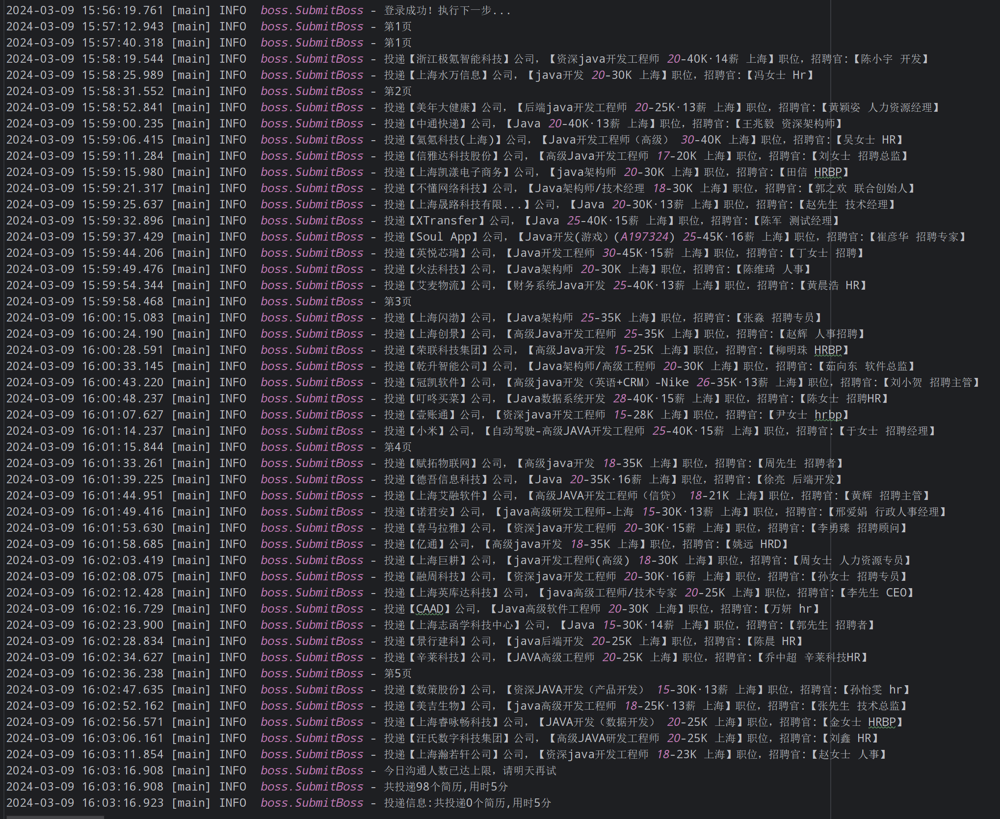
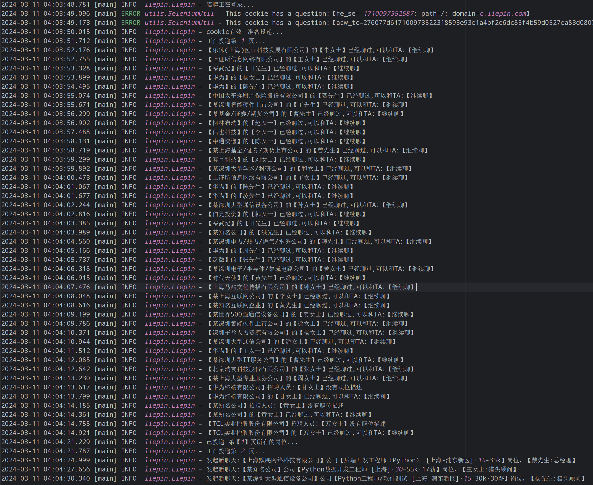
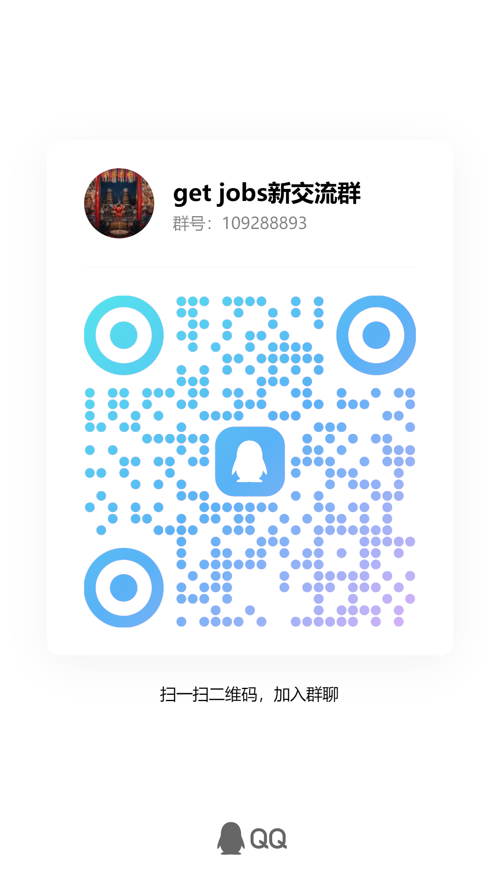

<h1 align="center"> get-jobs</h1>
<div align="center">
    💼自动投简历(Boss直聘、猎聘、拉勾、51job、智联招聘)
</div><br>

### 特色功能
- 支持国内全部招聘平台！(Boss直聘、猎聘、拉勾、51job、智联招聘)
- 支持cookie登录，每日仅需扫码一次
- 内置xpathHelper插件，方便快速定位元素
- 全局日志记录，投递记录可追踪
- Boss直聘默认过滤猎头岗位，可修改代码自定义

### 注意事项

- 由于不同系统的页面不一样，导致可能不兼容，文末会给出文档，尽可能让大家能自定义修改
- 需要关闭墙外代理，由于主要针对的国内平台，墙外代理会导致页面加载缓慢
- 如果你没有副屏，需要注释掉以下代码
   ```
   options.addArguments("--window-position=2600,750"); // 将窗口移动到副屏的起始位置
   options.addArguments("--window-size=1600,1000"); // 设置窗口大小以适应副屏分辨率
   ```
- boss出现访问异常：使用selenium在登录成功后boss会进行无限重定向导致账号ip异常(较低几率)
    - 解决方案：一般3秒后如果代码没有打开新的界面请关闭脚本并重新运行，若已出现异常，则手动过验证后重新运行即可。

## 如何使用？

#### 第一步：环境配置:JDK17+、Maven、Chrome、ChromeDriver

> driver路径为：**src/main/resources/chromedriver.exe** 版本号：122.0.6261.112  
> Chrome需要版本为:122.0.6261.112

> 例：你的Chrome【注意不是driver】路径是：**C:/Program Files/Google/Chrome/Application/chrome.exe** , 则修改 **SeleniumUtil
**
> 的 **getChromeDriver( )** 代码

```
options.setBinary("C:/Program Files/Google/Chrome/Application/chrome.exe");
```

更多详情请点击:[环境配置](https://github.com/loks666/get_jobs/wiki/环境配置)

#### 第二步：修改代码(一般默认即可)

- 通用配置
    - **page** ：从第几页开始投递，page不能小于1<br>
    - **maxPage**：投递到第几页<br>
    - **EnableNotifications**：是否开启Telegram机器人通知
    - 日志文件在 **target/logs** 目录下，所有日志都会输出在以运行日期结尾的日志文件中
    - **Constant.SAY_HI**: 打招呼语，boss需要关闭软件内自动打招呼功能(支持猎聘，boss)
    - **Constant.WAIT_TIME**：超时等待时间，单位秒，用于等待页面加载
    - **cookie登录**: 扫码后自动cookie.json文件在代码运行目录下，换号直接删除cookie.json即可


- boss直聘([Boss.java](src/main/java/boss/Boss.java))【每日仅可发起100次新聊天，活跃度还行，但是每日投递次数太少】
  ```
  experience //工作年限:在校生=108, 应届生=102, 经验不限=101, 一年以内=103, 1-3年=104, 3-5年=105, 5-10年=106, 10年以上=107
      └──设置工作年限：setYear(List.of("1-3年", "3-5年") //此为选择多种经验的方式，默认不设置年限筛选，需要手动添加
 
  page = 1; // 开始页 maxPage可以忽略，因为基本投不到
  
  data.json //黑名单数据，在投递结束后会查询聊天记录寻找不合适的公司添加进去
      ├── blackCompanies: List.of("复深蓝"); // 公司黑名单，多个用逗号分隔
      ├── blackRecruiters: List.of("猎头"); // 排除招聘人员，比如猎头
      └── blackJobs: List.of("外包", "外派"); // 排除岗位，比如外包，外派
  
  keyword = “Java”; // 岗位关键词
  
  Constant类的SAY_HI = "您好，我上班不要工资而且可以给公司钱！"; // 打招呼语，自行设置，需要关闭自动打招呼
  
  cityCode //城市代码，默认已给出热门城市，可以在boss直聘选择城市后，在地址栏寻找自己的目标城市码
  注意：建议先在手机投递一些目标岗位，不想投时再使用脚本投递，以提高投递成功率
  ```

- 51job([Job.java](src/main/java/job51/Job51.java))【投递无上限，会限制搜索到的岗位数量，没什么活人】

  ```
  jobArea=020000 //上海地区码，可以在51job选择地区后点击搜索，在地址栏寻找自己的目标地区码
  
  keywords:关键词 //通过keywords.get(?)使用
  
  scanLogin() //扫码登录(默认方式) 只可微信扫码，请绑定微信账号
  
  inputLogin() //密码登录(需要手动过验证)
  ```
- 拉勾([Lagou.java](src/main/java/lagou/Lagou.java))【投递无上限，会限制投递的频率，被51收购，和上面的一个德性】

   ```
   默认使用微信扫码，请绑定微信账号
  
   拉勾需要指定默认投递简历(在线简历 or 附件简历)，否则会投递失败
  
   拉勾直接使用的是微信扫码登录，运行后直接扫码即可，开箱通用
  
   但是拉勾由于反爬机制较为严重，代码中嵌套了大量的sleep，导致效率较慢
  
   这边建议拉勾的脚本运行一段时间后差不多就行了，配合手动在app或者微信小程序投递简历效果更佳！
   ```

- 猎聘([Liepin.java](src/main/java/liepin/Liepin.java))【默认打招呼无上限，主动发消息有上限，虽然成功率不高，好在量大】

   ```
   猎聘已支持cookie登录，有效期内无须每次扫码，只可微信扫码，请绑定微信账号
  
   在猎聘网选择自己要投递的地区后，在地址栏找到cityCode，修改cityCode为该值即可(默认为上海)
  
   会遍历投递keywords中所有的关键词，可自行设置
  
   当发起新会话到达上限后会使用系统默认的打招呼语，如需在上限后停止投递，将isStop改为true即可
  
   目前猎聘关闭了发自定义消息，需要打开猎聘的自动招呼设置(可支持自定义)，如需程序发送可以将isSayHi的值改为true即可
  
   最新版猎聘手机端可以自定义打招呼方式，只要不主动发消息，可以无限制对猎头打招呼，目前默认配置已支持这样做。
   ```

- 智联招聘([ZhiLian.java](src%2Fmain%2Fjava%2Fzhilian%2FZhiLian.java))【投递上限100左右，岗位质量较差,走投无路可以考虑】

   ```
  智联招聘需要指定默认投递简历(在线简历 or 附件简历)，否则会投递失败
  
  只可微信扫码，请绑定微信账号
  
  cityCode //地区码，需要选择地区后在地址栏找到cityCode，修改cityCode为该值即可(默认为上海)
  
  salaryScope //工资区间，同上，可自行设置
  
  keywords //关键词列表，默认从第一个关键词投递到最后一个，投递上限时停止
   ```

#### 最后一步：运行代码

- 直接运行你想要投递平台的下的代码即可

****

#### 其他的有需要可以改，放开注释即可，不改不影响运行

- TelegramBot机器人通知（可选，需要代理）
   ```
   TELEGRAM_API_TOKEN: 你的机器人的token
   CHAT_ID: 你的机器人的chat_id
   ```

- 推送Telegram消息
   ```
   new TelegramNotificationBot().sendMessageWithList(message, returnList, "xx平台投递");
   ```

****

## 免责声名

为避免别有用心之人利用本代码进行违法活动，特此声明：

- 本项目完全开源，但将项目用于其他用途目的均与本项目无关，由此引发的一切法律责任由使用者自行承担。
- 现在这个大环境下就算有脚本的帮助可能机会也很少，但总归要试一试，不是么？
- 开源这个项目也希望能帮到真正需要它的人，不希望被任何有心之人利用
- 最后，希望各位永远不需要本项目的帮助，但别忘了star哟！
> 已经有人在交流群里发广告等与本项目无关的信息  
> 如果带着不同目的或者没想清楚就进群的  
> 一经发现群主会对您的家人及朋友进行亲切(没有素质)的问候  
> 并将您请出群聊，请珍惜交流的机会

### 例:Boss投递日志



### 猎聘投递日志



## 请我喝杯咖啡☕️

 

## 联系方式📧

- V2VDaGF0OkFpckVsaWF1azk1Mjcs6K+35aSH5rOo77ya5pq06aOO6Zuo5bCx6KaB5p2l5LqG
- 添加上面的微信，或者进入QQ群，联系进入微信群

## QQ群
- 扫码添加：加群答案为本项目仓库名【是仓库名！】  



> 点击下面的链接可直接加群

[![][qq-shield-badge]][qq-link]


## 付费部署
- 本项目文档已相对完善，如仍需付费部署，请添加QQ群或微信联系群主  
- win下环境部署：50/次
- mac下环境部署：100/次
- 如需定制修改具体功能请联系商议  
- 注意：本项目不支持服务器部署，因为招聘网站发现访问者为服务器IP，不会返回任何网站数据
--- 

- 授人以渔: [自定义修改你的代码](https://github.com/loks666/get_jobs/wiki/授人以渔‐自定义修改你的代码)

- 本项目受此启发:https://github.com/BeammNotFound/get-jobs-51job , 感谢大佬，让我们将爱传递下去~

<!-- LINK GROUP -->

[qq-link]: http://qm.qq.com/cgi-bin/qm/qr?_wv=1027&k=BV_WjeFlg3s--MePsk0OyBXMWH0tK5DR&authKey=lyaZwh50DkD8wrpM2A9BCXzutG3O4gK0mTwm6ODk9EBij%2FNZAHGBT05KmLgLTG%2BL&noverify=0&group_code=219885606

[qq-shield-badge]: https://img.shields.io/badge/QQ交流群-get_jobs-0FB5EB?labelColor=235389&logo=tencent-qq&logoColor=white&style=flat